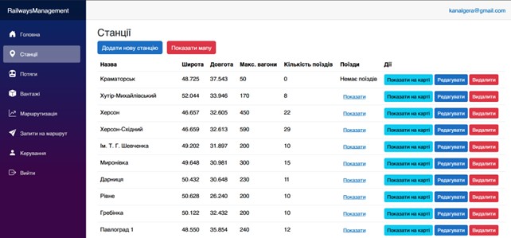
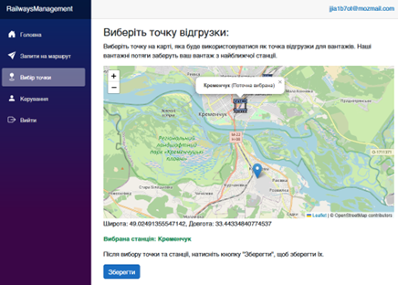
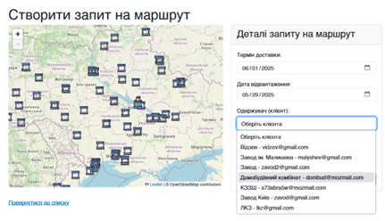
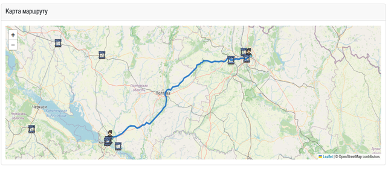
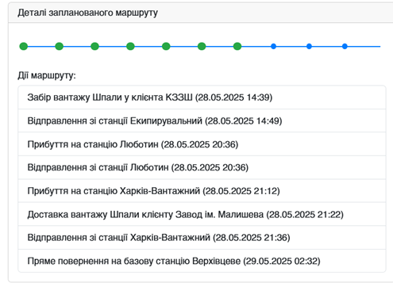

# RailwaysManagement

Вебзастосунок для планування та моніторингу регіональних маршрутів вантажних поїздів.
Розроблений як кваліфікаційна робота бакалавра зі спеціальності «Комп’ютерні науки».

## Основні можливості

- Рольові сценарії для адміністраторів, диспетчерів і клієнтів.
- Керування станціями, поїздами, вантажами, користувачами та заявками.
- Вибір місця клієнта й визначення найближчої станції на інтерактивній карті.
- Автоматизоване планування маршрутів із проміжними станціями та обмеженнями місткості.
- Візуалізація відправлень, прибуттів, завантаження, розвантаження та повернення поїзда.
- Формування звітів про маршрут із деталями перевезення.

## Скріншоти

## Технології

- ASP.NET Core 9, Blazor Server, Razor Components, C#
- Entity Framework Core, MySQL/SQLite, міграції EF
- ASP.NET Core Identity і рольова авторизація
- Leaflet, OpenStreetMap та OpenRailRouting API
- Bootstrap, CSS, JavaScript interop, JSON-конвертери
- Syncfusion для генерації Word-звітів

---

# RailwaysManagement

Web application for planning and monitoring regional freight-train routes.
Developed as a bachelor's qualification project in Computer Science.

## Key capabilities

- Role-based workflows for administrators, dispatchers, and clients.
- Management of stations, trains, cargo, users, and route requests.
- Client location selection and nearby-station assignment on an interactive map.
- Automated route planning with intermediate stations and train-capacity constraints.
- Route visualization with departures, arrivals, loading, unloading, and return actions.
- Exportable route reports containing operational and cargo details.

## Screenshots

## Tech stack

- ASP.NET Core 9, Blazor Server, Razor Components, C#
- Entity Framework Core, MySQL/SQLite, and EF migrations
- ASP.NET Core Identity with role-based authorization
- Leaflet, OpenStreetMap, and OpenRailRouting API
- Bootstrap, CSS, JavaScript interop, and JSON converters
- Syncfusion-based Word report generation
